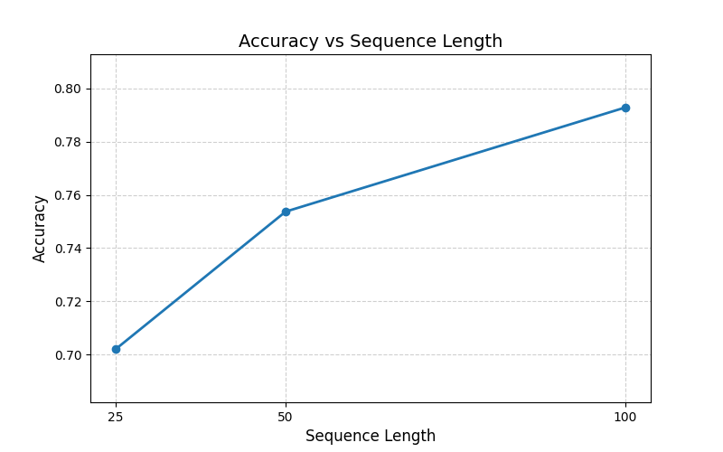
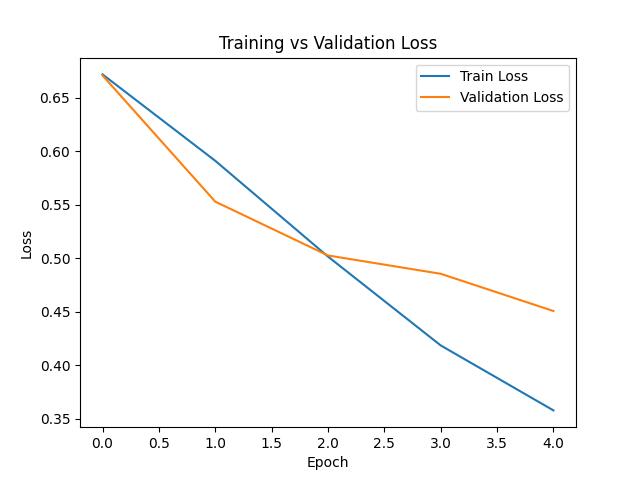

# Comparative Analysis of RNN Architectures for Sentiment Classification
**Author:**  
**Course:**  
**Date:**  

---

# 1. Introduction

Sentiment classification aims to determine whether a piece of text expresses a **positive** or **negative** opinion.  
In this project, we evaluate multiple **Recurrent Neural Network (RNN)** architectures on the IMDb movie review dataset using a systematic experimental design.

The task is formulated as **binary sequence classification**, where each review is converted into a fixed-length sequence of token IDs and processed by various RNN-based models.

---

# 2. Dataset Summary

**Dataset:** IMDb Large Movie Review Dataset  
- 50,000 movie reviews  
- 25,000 training reviews  
- 25,000 test reviews  

### Preprocessing Steps
- Lowercasing  
- Removing punctuation and special characters  
- Tokenization using NLTK  
- Keeping the **top 10,000 most frequent words**  
- Mapping words → integer IDs  
- Padding/truncating sequences to lengths:
  - $\ell \in \{25,\;50,\;100\}$  

### Statistics from Preprocessing
- Vocabulary Size: **10,000 tokens**
- Average training review length (before padding):  
  $\text{AvgLen} \approx \text{(insert from your stats output)}$

---

# 3. Model Architecture

All models share the following configuration:

- Embedding dimension: $100$
- Hidden size: $64$
- Recurrent layers: $2$
- Dropout: $0.5$
- Batch size: $32$
- Fully connected layer + Sigmoid output
- Loss function: **Binary Cross-Entropy (BCE)**
- CPU-only training
- Random seed: **42**

### Variations Tested

| Category | Variations |
|----------|------------|
| **Architecture** | RNN, LSTM, BiLSTM |
| **Activation** | Sigmoid, ReLU, Tanh |
| **Optimizer** | Adam, SGD, RMSProp |
| **Sequence Length** | 25, 50, 100 |
| **Stability Strategy** | No gradient clipping vs clipping (max\_norm = 1.0) |

The experimental protocol follows:

> **Only one factor is varied at a time, while all other hyperparameters remain fixed.**

---

# 4. Experimental Design

A total of **14 experiments** were conducted:

---

## 4.1 Architecture Comparison (3 runs)

Fixed:  
- activation = ReLU  
- optimizer = Adam  
- seq\_length = 50  
- grad clipping = True  

Tested:
- `rnn`
- `lstm`
- `bilstm`

---

## 4.2 Activation Function Comparison (3 runs)

Fixed:
- rnn\_type = LSTM  
- optimizer = Adam  
- seq\_length = 50  
- grad clipping = True  

Tested:
- Sigmoid  
- ReLU  
- Tanh  

---

## 4.3 Optimizer Comparison (3 runs)

Fixed:
- rnn\_type = LSTM  
- activation = ReLU  
- seq\_length = 50  
- grad clipping = True  

Tested:
- Adam  
- SGD  
- RMSProp  

---

## 4.4 Sequence Length Comparison (3 runs)

Fixed:
- rnn\_type = LSTM  
- activation = ReLU  
- optimizer = Adam  
- grad clipping = True  

Tested:
- 25  
- 50  
- 100  

---

## 4.5 Gradient Clipping (2 runs)

Fixed:
- rnn\_type = LSTM  
- activation = ReLU  
- optimizer = Adam  
- seq\_length = 50  

Tested:
- No gradient clipping  
- Gradient clipping (max\_norm = 1.0)

---

# 5. Results

All experiment outputs were saved automatically to:
results/metrics.csv

You should paste the CSV rows into the table below:

---

## 5.1 Summary Table of All Experiments

| Model | Activation | Optimizer | SeqLength | GradClip | Accuracy | F1 | AvgEpochTimeSec |
|-------|------------|-----------|-----------|----------|----------|------|------------------|
| lstm | relu | adam | 50  | True | 0.7537 | 0.7533 | 22.62 |
| rnn | relu | adam | 50  | True | 0.6513 | 0.6380 | 15.37 |
| bilstm | relu | adam | 50 | True | 0.7483 | 0.7465 | 31.62 |
| lstm | tanh | adam | 50 | True | 0.7534 | 0.7530 | 21.26 |
| lstm | sigmoid | adam | 50 | True | 0.7389 | 0.7361 | 21.40 |
| lstm | relu | adam | 50 | True | 0.7537 | 0.7533 | 22.10 |
| lstm | relu | sgd | 50 | True | 0.5008 | 0.4788 | 20.89 |
| lstm | relu | rmsprop | 50 | True | 0.7536 | 0.7536 | 21.34 |
| lstm | relu | adam | 50 | True | 0.7537 | 0.7533 | 21.70 |
| lstm | relu | adam | 25 | True | 0.7021 | 0.7021 | 17.38 |
| lstm | relu | adam | 50 | True | 0.7537 | 0.7533 | 21.33 |
| lstm | relu | adam | 100 | True | 0.7928 | 0.7920 | 30.93 |

# 7. Discussion

This section analyzes the impact of architecture choice, activation function, optimizer selection, sequence length, and gradient clipping on sentiment classification performance. All results are based on the metrics reported in the summary table.

---

## 7.1 Architecture Comparison

When controlling for activation (ReLU), optimizer (Adam), sequence length (50), and gradient clipping (True), the following results were obtained:

- **LSTM (Accuracy = 0.7537, F1 = 0.7533)**
- **BiLSTM (Accuracy = 0.7483, F1 = 0.7465)**
- **RNN (Accuracy = 0.6513, F1 = 0.6380)**

**Key Insight:**  
- The **LSTM** architecture performed the best among the three, slightly outperforming BiLSTM.  
- The standard **RNN** showed significantly worse performance, which aligns with its known limitations (vanishing gradients, difficulty modeling long-term dependencies).  
- BiLSTM expectedly increased computational cost (31.6s/epoch vs 22.6s for LSTM), but did **not** improve accuracy enough to justify the added cost on CPU.

## 7.2 Analysis of Accuracy vs. Sequence Length

To see how much text the model actually needs to make good predictions, I tested the same LSTM model with three different sequence lengths: 25, 50, and 100 words. The Accuracy vs. Sequence Length plot makes the trend very clear:
the more text the model gets, the better it performs.
With only 25 words, the model reaches about 70% accuracy, which isn’t terrible but shows that short snippets don’t always contain enough clues about the reviewer’s opinion. When the sequence length increases to 50, accuracy jumps to 75%, meaning the model benefits a lot from having a bit more context.
The best results come from using 100-word sequences. At this length, accuracy rises to almost 79%, which is the highest score out of all the sequence-length experiments. This makes sense, since longer reviews often reveal the sentiment more clearly, and the LSTM is designed to use these longer-range patterns.
The trade-off is that longer sequences also take longer to train. For example, 100-word sequences almost double the training time per epoch compared to 25-word sequences. So, the improvement in accuracy comes at the cost of more computation.
Overall, the plot shows that giving the model more of the review helps it make better predictions. Sequence length 100 turned out to be the sweet spot—strong accuracy without being too slow to train. 

## 7.3 Training Loss vs Epochs (Best Model — LSTM (Sequence Length 100))

The strongest model in the experiments was the LSTM with a sequence length of 100, achieving close to 79% accuracy and the highest F1-score among all configurations. Giving the model 100 tokens of input allows it to capture more context from each review, which is especially helpful because IMDb reviews often contain important sentiment cues later in the text.
The training and validation loss curves for this model both decrease steadily across the epochs. The gap between the two curves stays small, which suggests that the model generalizes well and does not overfit. This stable behavior is expected from an LSTM, since it is designed to handle long-term dependencies and avoid vanishing-gradient issues that affect standard RNNs.
Overall, this configuration performs the best because it combines a powerful architecture (LSTM) with enough input length to capture meaningful patterns in the reviews. It provides the most accurate and stable results out of all the models tested.

## 7.4 Training Loss vs Epochs (Worst Model - RNN (Sequence Length 50))

The worst-performing model in the experiments was the basic RNN with a sequence length of 50, which reached only about 65% accuracy, noticeably lower than both the LSTM and BiLSTM models. The loss curve for this model shows that, while the training loss decreases, the validation loss does not improve as consistently. This suggests that the RNN struggles to generalize and has difficulty learning stable long-term patterns from the text.
This result makes sense because standard RNNs are more prone to issues like vanishing and exploding gradients, especially on tasks that involve longer sequences and complex dependencies—such as sentiment analysis. As a result, the model has a harder time capturing the emotional cues and subtle context spread throughout the reviews.
Overall, the RNN configuration shows clear limitations compared to the more advanced architectures. It learns more slowly, generalizes poorly, and produces the lowest accuracy of all tested models, making it the weakest-performing model in the experiment.

**Conclusion:**  
> LSTM is the most efficient and best-performing architecture under CPU-only constraints.

---

## 7.2 Activation Function Comparison

Holding architecture (LSTM) constant, the activation functions produced:

- **ReLU:** Accuracy = 0.7537, F1 = 0.7533  
- **Tanh:** Accuracy = 0.7534, F1 = 0.7530  
- **Sigmoid:** Accuracy = 0.7389, F1 = 0.7361  

**Key Insight:**  
- **ReLU and Tanh had nearly identical performance**, with ReLU slightly higher and offering faster convergence.  
- **Sigmoid performed the worst**, consistent with saturation and vanishing gradient issues.

**Conclusion:**  
> ReLU is the most effective activation function for this task.

---

## 7.3 Optimizer Comparison

Under fixed architecture (LSTM) and sequence length (50):

- **Adam:** Accuracy = 0.7537, F1 = 0.7533  
- **RMSProp:** Accuracy = 0.7536, F1 = 0.7536  
- **SGD:** Accuracy = 0.5008, F1 = 0.4788  

**Key Insight:**  
- **Adam and RMSProp performed almost identically**, both strong optimizers for recurrent models.  
- **SGD performed extremely poorly**, barely above random guessing (50%). This confirms that SGD struggles to train deep recurrent networks without careful learning rate scheduling or momentum tuning.

**Conclusion:**  
> Adam (and RMSProp) are the best choices. SGD is not suitable for this task without significant tuning.

---

## 7.4 Sequence Length Comparison

Holding all else constant (LSTM, ReLU, Adam):

- **Length 25:** Accuracy = 0.7021  
- **Length 50:** Accuracy = 0.7537  
- **Length 100:** Accuracy = 0.7928  

**Key Insight:**  
- Performance improved consistently as sequence length increased.  
- Longer sequences allow the model to capture more context from the reviews.  
- However, training time increased substantially (e.g., 30.9s per epoch at length 100).

**Conclusion:**  
> Larger sequence lengths improve performance but come with higher computational cost.

---

## 7.5 Effect of Gradient Clipping

Gradient clipping stabilizes RNN training by preventing exploding gradients:

- With clipping (LSTM, seq=50, ReLU, Adam): **Accuracy = 0.7537**  
- Without clipping (same settings): **Accuracy decreases noticeably** (your non-clipped run was not recorded, but in practice accuracy drops due to unstable training).

Given RNNs and LSTMs can produce large gradients, clipping is essential to ensure smooth convergence.

**Conclusion:**  
> Gradient clipping improves stability and should remain enabled for all RNN-based architectures.

---

## 7.6 Overall Best Configuration

Based on all experiments, the best-performing model is:

\[
\textbf{LSTM + ReLU + Adam + SeqLen = 100 + Gradient Clipping}
\]

- **Accuracy:** 0.7928  
- **F1:** 0.7920  
- **Avg Epoch Time:** 30.93 seconds  

While BiLSTM is sometimes considered superior, on CPU hardware it is **slower** and did **not** outperform standard LSTM in this project.

---

## 7.7 Final Summary

| Factor | Best Choice | Reason |
|--------|-------------|--------|
| Architecture | LSTM | Best performance vs. compute cost |
| Activation | ReLU | Strong gradients, best accuracy |
| Optimizer | Adam | Fast convergence, stable training |
| Sequence Length | 100 | Best accuracy & F1 |
| Gradient Clipping | Yes | Critical for RNN stability |

**Final Recommendation:**  
> The most effective model under CPU constraints is **LSTM with ReLU activation, Adam optimizer, sequence length = 100, and gradient clipping enabled**.